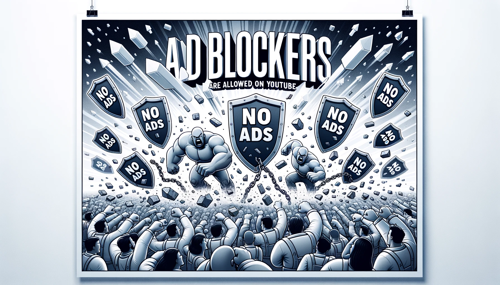
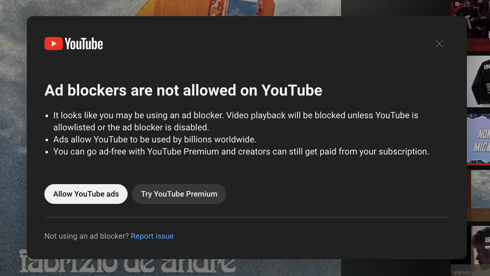

# Ad Blockers are Allowed on YouTube - Chrome Extension



This Chrome Extension is a quick workaround for those who, like me, love to have their YouTube music playing in the background while coding, but find the recent 'Ad blockers are not allowed on YouTube' popup quite disruptive. The extension constantly monitors for this popup and dismisses it automatically, ensuring your music plays uninterrupted.

## Table of Contents
- [Ad Blockers are Allowed on YouTube - Chrome Extension](#ad-blockers-are-allowed-on-youtube---chrome-extension)
  - [Table of Contents](#table-of-contents)
  - [Background](#background)
  - [How it Works](#how-it-works)
    - [manifest.json](#manifestjson)
    - [background.js](#backgroundjs)
    - [content.js](#contentjs)
  - [Get Involved](#get-involved)
  - [My links](#my-links)

## Background
The recent feature by YouTube, which discourages the use of ad blockers by displaying a popup message, necessitated a simple yet effective solution to avoid any disruptions, especially while enjoying music during coding sessions. You can read more about this issue and the motivation behind creating this extension in my [Medium article](https://medium.com/@glizzykingdreko/ad-blockers-are-allowed-on-youtube-40a040a2d039?postPublishedType=initial).

## How it Works
The extension comprises three main files: `background.js`, `content.js`, and `manifest.json`.

### manifest.json
Don't think is needs any explanation. It's the manifest file for the extension. It contains the name, description, version, and other details about the extension. It also contains the permissions required by the extension to function properly. In this case, the extension requires access to the `tabs`, `activeTab` and `scripting` APIs.

### background.js
This script sets up an event listener which, upon the completion of loading a YouTube tab, triggers the execution of `content.js` script on that particular tab.
```javascript
chrome.tabs.onUpdated.addListener((tabId, changeInfo, tab) => {
    if (changeInfo.status === 'complete' && /^https:\/\/www\.youtube\.com/.test(tab.url)) {
        chrome.scripting.executeScript({
            target: {tabId: tabId},
            files: ['content.js']
        });
    }
});
```

### content.js
The content.js script houses two main functions: `startVideo` and `checkAndRemovePopup`. `startVideo` function triggers the play button on YouTube, and `checkAndRemovePopup` function checks for the presence of the ad blocker popup and removes it if found. Additionally, it calls startVideo to ensure the video resumes play.
```javascript
function startVideo() {
    const playButton = document.querySelector('.ytp-play-button.ytp-button');
    const title = playButton.getAttribute('data-title-no-tooltip');
    if (playButton && title == "Play") {
        playButton.click();
        console.log("Video Played");
    }
}

function checkAndRemovePopup() {
    const popupContainer = document.querySelector('ytd-popup-container');
    if (popupContainer) {
        popupContainer.remove();
        console.log("Adblock popup removed");
        // startVideo()
        // call here instead if you want to play the video only after the popup is removed
    }
    startVideo(); 
    // call here if you, like me, wanna always have the video running
}

// Call the function at regular intervals
setInterval(checkAndRemovePopup, 1000);
// Adjust the interval as per your needs
```

## Get Involved
Feel free to clone, modify, or improve upon this extension as per your preferences. Your contributions towards making this extension more robust or feature-rich are highly welcomed. Also, if you've found this extension helpful or have suggestions, do reach out. Happy coding, and enjoy a block-free YouTube experience!

Bye bye ads! 👋


## My links

- [Medium Article](https://medium.com/@glizzykingdreko/ad-blockers-are-allowed-on-youtube-40a040a2d039?postPublishedType=initial)
- [Website](https://glizzykingdreko.github.io/)
- [GitHub](https://github.com/glizzykingdreko)
- [Twitter](https://mobile.twitter.com/glizzykingdreko)
- [Medium](https://medium.com/@glizzykingdreko)
- [Email](mailto:glizzykingdreko@protonmail.com)